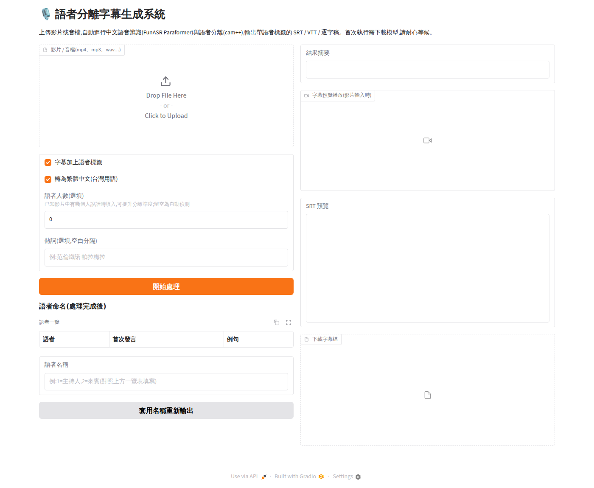

# 🎙️ 語者分離字幕生成系統

**v1.0 — 第一次正式版**(2026-07)

在本地端運行的影片語者分離(Speaker Diarization)+ 中文語音辨識字幕生成系統。
上傳影片或音檔,自動輸出**繁體中文**、帶語者標籤的 SRT / VTT / 逐字稿,
並可在網頁上直接預覽播放。



```
1
00:00:00,000 --> 00:00:03,600
[主持人] 大家好,歡迎收聽本集節目。

2
00:00:04,200 --> 00:00:06,000
[來賓] 謝謝主持人邀請。
```

## 功能特色

- **中文準度優先**:FunASR Paraformer-large(SeACo),中文辨識優於 Whisper 原版,內建標點與時間戳
- **語者分離**:cam++ 自動標記誰在說話;已知人數時可指定「語者人數」大幅提升準度
- **繁體中文輸出**:OpenCC s2twp,含台灣用語轉換(软件→軟體、视频→影片),預設開啟
- **處理後語者命名**:完成後顯示「語者一覽」(每位語者首次發言時間+例句),
  對照填入名稱按「套用名稱重新輸出」,秒級完成、不需重跑辨識
- **字幕預覽播放**:影片輸入時,結果區直接顯示帶字幕的播放器
- **熱詞**:輸入專有名詞(人名、術語)提升辨識率
- **三種格式**:SRT(影片播放器/YouTube)、VTT(網頁)、TXT(逐字稿)
- **Docker 一鍵部署**:免手動處理 Python / CUDA 環境

## 系統需求

| 項目 | 需求 |
|---|---|
| 作業系統 | Windows 10/11(WSL2)或 Linux |
| Docker | Docker Desktop(WSL2 後端)或 Docker Engine + Compose |
| GPU | NVIDIA,建議 12GB 顯存以上(支援 RTX 20 ~ 50 系列) |
| 驅動 | RTX 50 系列需 570 以上(CUDA 12.8) |
| 磁碟 | 約 15GB(image + 模型) |

## 快速開始

```bash
git clone <本 repo>
cd Funasr-test

# 1. 檢查環境(Docker / NVIDIA 驅動 / GPU passthrough)
bash scripts/check_env.sh

# 2. 啟動(首次 build image + 第一次處理時自動下載約 1-2GB 模型)
docker compose up --build

# 3. 開啟瀏覽器
#    http://localhost:7860
```

模型快取在 Docker volume(`modelscope-cache`),之後啟動不需重新下載。
輸出字幕檔同步寫到宿主機的 `./output/`。

### 使用流程

1. 拖拉上傳影片或音檔(mp4 / mp3 / wav / mkv…)
2. (選填)已知人數時填「語者人數」、輸入熱詞
3. 按「開始處理」,等進度條跑完
4. 右側預覽播放、下載 SRT / VTT / TXT
5. 對照「語者一覽」填入名稱(如 `1=主持人,2=來賓`)→「套用名稱重新輸出」

### 沒有 GPU / 排查 GPU 問題

```bash
docker compose -f docker-compose.cpu.yml up --build
```
CPU 模式速度慢很多,僅供測試;能啟動代表程式正常,問題在 GPU 掛載層。

## 本地開發(不用 Docker)

```bash
python -m venv .venv && source .venv/bin/activate
pip install -r requirements.txt   # torch 請依 https://pytorch.org 選擇 CUDA 版本
sudo apt install ffmpeg

# 命令列
python -m app.cli input.mp4 -o output/ --num-speakers 6 --speaker-names "1=主持人,2=來賓"

# Web 介面
python -m app.webui   # http://localhost:7860
```

### CLI 參數

| 參數 | 說明 |
|---|---|
| `-o / --output-dir` | 輸出目錄(預設 `output/`) |
| `--device` | `cuda:0` / `cpu`(預設自動偵測) |
| `--num-speakers` | 實際語者人數(已知時指定可提升分離準度,預設自動偵測) |
| `--speaker-names` | 語者顯示名稱,如 `"1=主持人,2=來賓"` |
| `--hotword` | 熱詞(空白分隔),提升專有名詞辨識率 |
| `--no-speaker` | 停用語者分離,只做 ASR |
| `--simplified` | 保留簡體輸出(預設轉繁體台灣用語) |
| `--merge-gap-ms` | 同語者相鄰句合併間隔上限(預設 800ms) |
| `--max-chars` | 單條字幕最大字元數(預設 42) |

## 播放字幕

- **Web 介面內直接看**:輸入是影片時,處理完成後右側出現帶字幕的預覽播放器
- **影片播放器**:把下載的 `.srt` 改成與影片同名放同一資料夾
  (如 `訪談.mp4` + `訪談.srt`),VLC / PotPlayer / MPC-HC 自動載入
- **YouTube / 剪輯軟體**:上傳 `.srt`(YouTube 字幕後台)或 `.vtt`(網頁播放器)

## 技術架構

| 模組 | 技術 |
|---|---|
| 中文語音辨識 | FunASR Paraformer-large(`paraformer-zh`,內建標點 `ct-punc` 與時間戳) |
| 語音活動偵測 | `fsmn-vad`(長音檔自動分段,避免顯存不足) |
| 語者分離 | `cam++`(campplus,支援 `preset_spk_num` 指定人數) |
| 音軌抽取 | ffmpeg(16kHz mono WAV) |
| 繁體轉換 | OpenCC `s2twp` |
| Web 介面 | Gradio |
| 部署 | Docker Compose + NVIDIA GPU(PyTorch 2.7.1 + CUDA 12.8) |

### 專案結構

```
app/
  engine.py     # FunASR AutoModel 封裝(ASR + VAD + 標點 + 語者分離)
  media.py      # ffmpeg 音軌抽取(16kHz mono WAV)
  subtitle.py   # sentence_info → 合併 → SRT/VTT/TXT
  convert.py    # OpenCC 簡體→繁體(台灣用語)
  pipeline.py   # 端到端流程、輸出重建、語者一覽
  cli.py        # 命令列介面
  webui.py      # Gradio Web 介面
tests/          # 單元測試(29 項,無需模型與 GPU)
scripts/        # 環境檢查腳本
docs/           # 文件與截圖
```

## 執行測試

```bash
pip install -r requirements-dev.txt
python -m pytest tests/ -v
```

## 常見問題

**Q: 容器一直重啟 / 啟動就崩潰?**
先看崩潰原因:`docker compose logs --tail=50 subtitle`。
再用 CPU 模式排查是否為 GPU 掛載問題(見上方)。

**Q: RTX 50 系列(5060 Ti / 5070…)跑不起來?**
Blackwell 架構需要 CUDA 12.8 以上。本專案 base image 已用
`pytorch 2.7.1 + cu128`;若你改過 Dockerfile,請勿降到 cu121 以下,
並把 NVIDIA 驅動更新到 570 以上。

**Q: WSL2 / Docker Desktop 整個掛掉重啟?**
可能是記憶體不足(模型載入需 4GB 以上)。在 Windows 使用者目錄建立
`.wslconfig` 提高上限後執行 `wsl --shutdown` 再重開 Docker Desktop:
```ini
[wsl2]
memory=12GB
swap=8GB
```

**Q: 首次處理很久沒反應?**
第一次執行會從 ModelScope 下載約 1-2GB 模型,看容器 log:
`docker compose logs -f`。

**Q: 語者數量判斷錯誤?**
已知實際人數時,在 Web UI 填「語者人數」或 CLI 加 `--num-speakers N`,
會直接指定聚類數量,準度明顯提升。自動偵測時,重疊語音、笑聲、
背景音都可能被誤判成額外語者。

**Q: 改語者名稱後播放器字幕沒更新?**
瀏覽器可能快取舊字幕,重新整理頁面即可;下載的檔案一定是最新的。

## 已知限制

- 針對中文優化;其他語言準度未驗證
- 多人重疊說話時 diarization 可能誤判
- 尚無批次處理與時間軸微調介面(規劃中)

## 版本紀錄

- **v1.0**(2026-07):第一次正式版 — GPU 推論(含 RTX 50 系列)、語者分離
  與人數指定、繁體中文輸出、處理後語者命名、UI 字幕預覽播放、Docker 一鍵部署
